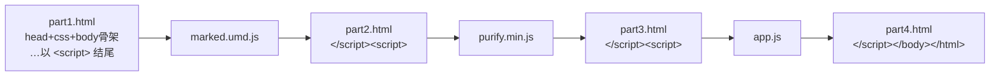
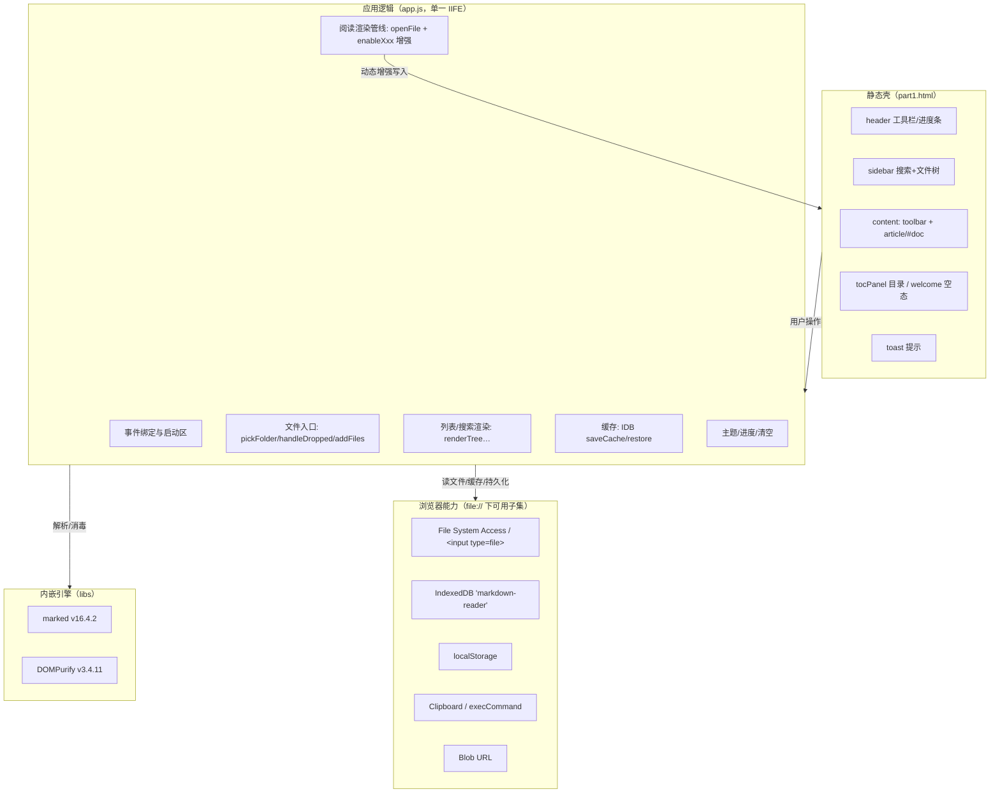
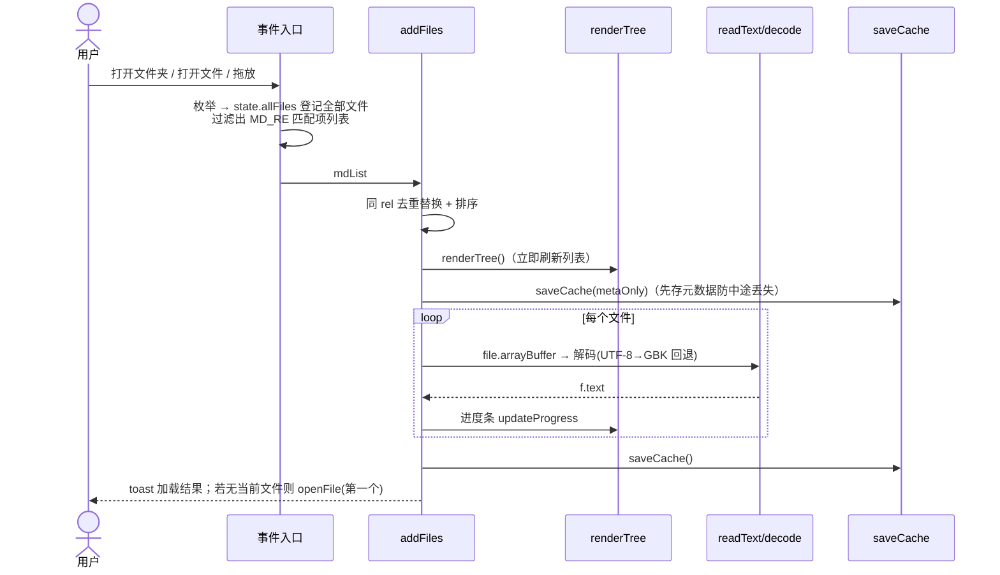
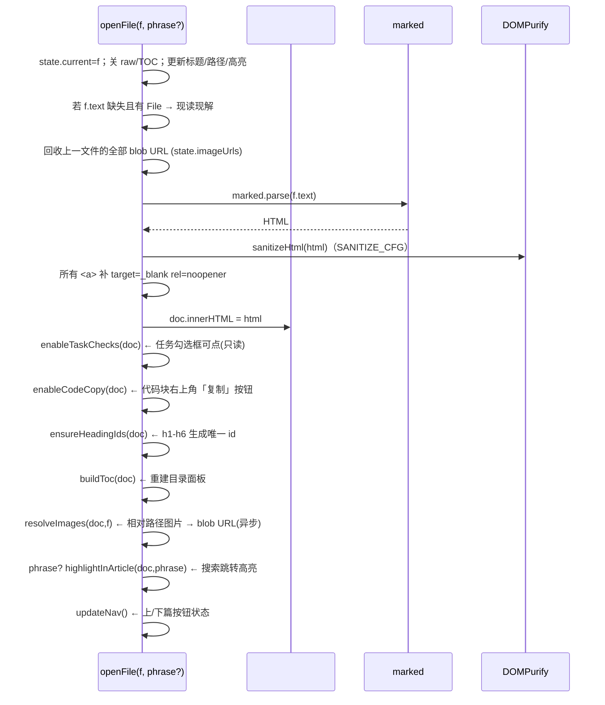
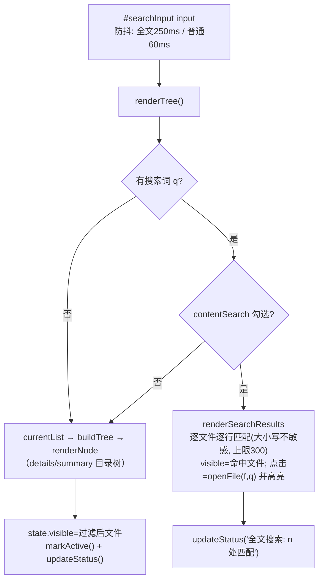

# 📐 Markdown 浏览器 · 软件设计文档

> 本文档是改代码时的"地图"：讲清文件怎么组织、运行时怎么分层、数据长什么样、
> 关键流程怎么走、每个函数管什么、想改一个功能该动哪里。
>
> **适用代码快照**：仓库当前 `src/` + `libs/`（含"代码块一键复制""界面国际化""侧栏折叠"
> "正文宽度可拖拽调整"功能，2025 年初版基线）。
> 若后续架构有变，请同步更新本文档（维护约定见文末）。
>
> **图例说明**：文中流程图/时序图用 Mermaid 编写，请用支持 Mermaid 的查看器阅读
> （GitHub 网页版、VS Code + Markdown Preview Mermaid 插件、Typora 等）。
> 本项目自带的浏览器不渲染 Mermaid（会以代码块形式显示），不影响表格与文字阅读。

---

## 1. 项目概览

| 项 | 内容 |
| --- | --- |
| 定位 | 纯前端、完全离线的本地 Markdown 阅读器，**单文件 HTML 成品**，双击即用 |
| 运行方式 | 通过 `file://` 直接打开，无服务器、无构建工具链（仅"拼接"） |
| 渲染引擎 | **marked v16.4.2**（Markdown → HTML，GFM 风格） |
| 消毒引擎 | **DOMPurify 3.4.11**（XSS 过滤） |
| 语言/风格 | 原生 ES5 风格 JavaScript（`var` + 函数声明 + IIFE），无框架、无模块化 |
| 网络 | 零请求。页面、库、图标（data: URL）全部内嵌 |

### 1.1 核心设计原则（改代码前先读）

1. **一条数据流，两个"增强"点**：所有 Markdown 内容最终都走
   `marked.parse → DOMPurify → doc.innerHTML → 若干"渲染后增强函数"`。
   新增任何"在渲染结果上做手脚"的逻辑（如给元素加按钮/属性），都应写成
   **幂等、可重入的 `enableXxx(doc)` 函数**，并在文末 6.2 列出的**全部 innerHTML 赋值点**调用。
2. **用户内容永不直接拼 HTML**：凡要插入用户文本，一律用 `esc()` 或
   `createElement/textContent`；任何途径都不许绕过 DOMPurify。
3. **能力探测 + 静默降级**：每个新浏览器 API（目录选择、剪贴板、IndexedDB…）
   都有降级路径，降级失败也不影响其它功能。
4. **ES5、零依赖**：保持与现有代码一致的写法；`src/` 是源，`index.html` 是产物，
   **改完源码必须重建 index.html 并提交两者**（见第 2 节）。
5. **UI 文案国际化**：界面文案一律走 `tr(key)` 或 `data-i18n` 标注（默认中文，支持英文），
   **不许把中文/英文硬编码在 JS 或 HTML 里**；Markdown 正文永远原样渲染、不参与翻译。

---

## 2. 文件结构与构建流程

```text
markdown-reader/
├── index.html          ← 成品（直接使用的就是它）
├── README.md           ← 用户文档 + 构建命令
├── DESIGN.md           ← 本文档
├── src/                ← 页面源码（拆分存放，构建时拼接）
│   ├── part1.html      ← <head>、全部 CSS、<body> 静态骨架，以 <script> 开标签结尾
│   ├── part2.html      ← 过渡缝：</script><script>
│   ├── part3.html      ← 过渡缝：</script><script>
│   ├── part4.html      ← 收尾：</script></body></html>
│   └── app.js          ← 全部应用逻辑（唯一 JS）
└── libs/               ← 内嵌第三方库（已随页面上线，勿在浏览器里外链）
    ├── marked.umd.js   ← marked v16.4.2（MIT，见 marked.LICENSE.md）
    └── purify.min.js   ← DOMPurify 3.4.11（Apache-2.0/MPL-2.0，见 purify.LICENSE）
```

### 2.1 拼接原理（"缝"的位置决定了 index.html 的结构）

`index.html` 并不是简单四段相连，而是把库源码**嵌进四个 part 围出的三个 `<script>` 块**里：



即最终 HTML 依次是：`<script>marked 源码</script>`、`<script>DOMPurify 源码</script>`、
`<script>app.js</script>`。所以全局可用 `marked`、`DOMPurify` 两个引擎对象。

### 2.2 重新构建（改完 `src/` 后的标准动作）

```powershell
node --check src/app.js
$p1 = Get-Content -Raw 'src/part1.html'; $p2 = Get-Content -Raw 'src/part2.html'
$p3 = Get-Content -Raw 'src/part3.html'; $p4 = Get-Content -Raw 'src/part4.html'
$app = Get-Content -Raw 'src/app.js'
$mk  = (Get-Content -Raw 'libs/marked.umd.js').Replace('</script','<\/script')
$pu  = (Get-Content -Raw 'libs/purify.min.js').Replace('</script','<\/script')
[System.IO.File]::WriteAllText((Join-Path $PWD 'index.html'), ($p1+$mk+$p2+$pu+$p3+$app+$p4), (New-Object System.Text.UTF8Encoding($false)))
```

> 说明：库源码里若出现字面 `</script>` 会把外层 HTML 切断，故构建时替换成 `<\/script`。
> 产物是 **UTF-8 无 BOM**；仓库开启 `.gitattributes`（`* text=auto`），提交时行尾会归一化。

**构建后的自检**：浏览器地址栏给 `index.html` 加 `#selftest`（见第 10 节），或跑无头 Chrome。

---

## 3. 运行时架构



关键点：

- **app.js 是一个大 IIFE**，内部按"注释分区"组织（`小工具 / IndexedDB 缓存 / 打开文件 /
  列表渲染 / 阅读 / 主题 / 进度 / 清空 / 事件绑定 / 启动`）。没有模块导出；
  函数之间通过闭包直接互调。
- **状态集中在 `state` 对象**（见第 4 节），UI 是它的投影：任何列表/阅读视图的变化，
  先改 `state` 再调对应渲染函数。

---

## 4. 数据模型

### 4.1 全局状态 `state`（app.js 顶部）

| 字段 | 类型 | 含义 | 主要读写方 |
| --- | --- | --- | --- |
| `state.files` | Array | 已加载的 **Markdown 文件条目**（排好序） | `addFiles` 写；列表、搜索、导航读 |
| `state.allFiles` | Map(rel→File) | 目录内**所有**文件（含图片等非 md，供相对路径图片解析） | 目录/文件选择与拖放时写 |
| `state.current` | 条目 \| null | 当前正在阅读的文件 | `openFile` |
| `state.visible` | Array | 当前"可见列表"（过滤/全文搜索后的子集；上下篇导航以此为准） | `renderTree` / `renderSearchResults` |
| `state.filter` | String | 侧栏搜索词 | 搜索框 input |
| `state.contentSearch` | Bool | 是否"全文"搜索模式 | `#searchContent` |
| `state.reading` | Bool | 正在批量读取文件（用于取消） | `addFiles` / `btnCancelRead` |
| `state.rawMode` | Bool | 是否处于"源文本"视图 | `toggleRaw` |
| `state.imageUrls` | Map(rel→blobURL) | 相对图片生成的 objectURL，切文件时统一回收 | `resolveImages` |

### 4.2 文件条目（`state.files` 元素 / 缓存恢复条目的形状）

```js
{
  name: 'foo.md',        // 文件名
  rel:  '文件夹/子目录/foo.md', // 逻辑相对路径，分隔符恒为 '/'
  size: 1234,            // 字节数
  file: File|null,       // 原始 File；从缓存恢复时为 null
  text: '…'|null,        // 已解码的文本；读取失败为 null
  from: 'picker'|'file'|'cache', // 来源
  error: '读取失败'|undefined
}
```

`rel` 是**身份键**：排序（natural localeCompare）、去重/替换、目录树构建、
相对图片解析、当前项高亮、缓存索引都以它为准。

### 4.3 持久化

| 存储 | 内容 |
| --- | --- |
| IndexedDB：库 `markdown-reader` v1，store `kv`，键 `last` | `{id:'last', savedAt, folder, files:[{name,rel,size,text}]}`。文本超过 `MAX_CACHE_TEXT`(4MB) 不缓存正文，仅保留之前缓存过的正文（`saveCache(metaOnly)` 分两阶段写） |
| localStorage：`mdreader-theme` | `'light' \| 'dark'` |
| localStorage：`mdreader-lang` | `'zh' \| 'en'`（默认 `'zh'`） |
| localStorage：`mdreader-sidebar` | `'1' \| '0'`（侧栏展开 / 折叠，默认 `'1'`） |
| localStorage：`mdreader-docwidth` | 正文栏宽度上限（px 数字字符串，如 `'1150'`；无此键 = 用 CSS 默认 `920px`） |
| 内存：`state.imageUrls` | 相对路径图片的 blob URL，切文件/清空时 `revokeObjectURL` |

### 4.4 界面文案与国际化（i18n）

- **字典**：app.js 顶部 `DICT = { zh: {…}, en: {…} }`，键名小驼峰、值可含 `{占位}` 模板。
- **查表**：`tr(key, params)` —— 取当前语言文案，`{x}` 用 `params.x` 替换；
  键缺失时回退中文，再缺失原样返回键名（便于发现漏翻）。
- **静态骨架**：part1.html 元素用 `data-i18n`（文本）/ `data-i18n-title`（tooltip）/
  `data-i18n-placeholder`（占位符）/ `data-i18n-aria-label`（无障碍名称）标注，
  由 `applyStaticLang()` 统一注入。
- **切换**：头部 `#btnLang`（显示目标语言 🌐 EN / 🌐 中文）→ `applyLang(next)`：
  存 localStorage → 刷静态文案 → 若有当前文件则重走 `openFile`（正文章节内动态文案
  如任务勾选框、代码复制按钮随新语言重建）→ 刷新侧栏/横幅。`applyLang(l, true)`
  用于启动（只刷静态文案，不重绘）。
- **红线**：只翻译程序界面，`state.files` 中的文件名、正文、搜索结果摘要**永不翻译**。

恢复流程：启动时 `refreshRestoreBanner()` 读到缓存、且当前列表为空 → 侧栏出现
「恢复上次」横幅 → 点击后把缓存条目映射回 `state.files`（`file:null`）并打开第一个文件。

---

## 5. 静态 UI 骨架与 DOM 索引

### 5.1 布局结构（part1.html）

```text
<body> (flex column, 折叠态 → body.side-collapsed)
├─ <header>  brand + #headerStatus + spacer + 按钮群(#btnDir #btnFiles #btnClear #btnTheme #btnLang)
│            └─ #progress (批量读取进度条, 默认 hidden)
├─ <main> (flex row)
│  ├─ <aside #sidebar> (可横向拖宽 220–540px；折叠时宽度收 0)
│  │   ├─ .side-top > #searchInput + #searchContent(全文)
│  │   ├─ #restoreBanner (hidden)      ← 缓存恢复横幅
│  │   ├─ #fileList                    ← 文件树 / 搜索结果列表渲染区
│  │   └─ #sideStatus
│  ├─ #sideRail (宽 0 的分缝容器，不占位)
│  │   └─ #btnSidebar                  ← 骑在栏目右缘的小圆钮：张开显 ‹，缩进显 ›
│  └─ <section #content> (flex column)
│      ├─ #toolbar (hidden)  #filePath + #btnPrev #navPos #btnNext #btnToc #btnCopy #btnRaw
│      ├─ #article > #doc              ← 阅读滚动容器 / 渲染产物挂载点
│      │       #doc 宽度上限 = CSS 变量 --doc-maxw（默认 920px，JS 只覆写这一个变量）
│      ├─ #tocPanel (hidden, 绝对定位右浮)
│      ├─ #welcome (hidden) 空态引导卡片
│      ├─ #docGripL (绝对定位, data-dir=-1)  ← 正文栏左缘宽度手柄：靠近栏缘显形 / 拖动改宽 / 双击复位
│      └─ #docGripR (绝对定位, data-dir=1)   ← 同上，右缘那条
└─ #toast (右下提示, JS 驱动 class 'show')
   #dirInput / #fileInput (隐藏 file input, 回退/多选用)
```

> `--doc-maxw` 只是**上限**：窗口变窄时正文栏由 CSS 自行收进可视宽度，窗口再变宽时又恢复成
> 用户调过的宽度，全程不需要 JS 参与（所以窗口缩放不会覆盖记忆值）。触屏与窄屏下
> （`@media (hover:none)`、`@media (max-width:760px)`）CSS 直接把 `max-width` 置为 `none`
> ——正文栏铺满，手柄一并隐藏。

### 5.2 DOM ID → 职责速查（改 UI 前先查表）

| ID | 位置 | 职责 | 在 app.js 的主要使用者 |
| --- | --- | --- | --- |
| `headerStatus` | header | 当前文件夹名 · 文件数 | `updateStatus`、selftest |
| `btnDir` / `btnFiles` / `btnClear` / `btnTheme` / `btnLang` | header | 打开文件夹 / 打开文件 / 清空 / 主题 / 语言切换 | 事件绑定区 |
| `sideRail` / `btnSidebar` | main（栏目右缘） | 0 宽分缝容器 + 骑在分缝上的 22px 圆钮（浅蓝底 `--accent-soft`）；张开显 ‹（点它缩进）、缩进显 ›（点它拉出），`title`/`aria-label`/`aria-expanded` 随之更新 | `applySidebar` / `toggleSidebar` / `syncSideToggle` / Ctrl+B |
| `progress` `progressBar` `progressText` `btnCancelRead` | header | 批量读取进度 | `showProgress/updateProgress/hideProgress` |
| `searchInput` `searchContent` | sidebar 顶 | 文件名过滤 / 全文搜索开关 | 事件绑定区 |
| `restoreBanner` | sidebar | 缓存恢复 UI（内含动态 `btnRestore`/`btnDelCache`） | `refreshRestoreBanner` |
| `fileList` | sidebar | 树/结果列表容器 | `renderTree` |
| `sideStatus` | sidebar 底 | 状态行 | `updateStatus` |
| `toolbar` `filePath` `btnPrev` `navPos` `btnNext` | content 顶 | 阅读工具条 | `openFile`/`updateNav`/事件区 |
| `btnToc` / `tocPanel` | content | 目录开关与面板 | 事件区、`buildToc`、Esc |
| `btnCopy` / `btnRaw` | toolbar | 复制原文 / 源文本切换 | `copyRaw` / `toggleRaw` |
| `article` / `doc` | content | 滚动容器 / 渲染挂载点（**几乎所有阅读逻辑的目标**） | `openFile` 及全部 `enableXxx`/`buildToc`/`resolveImages` |
| `docGripL` / `docGripR` | content（article 左右缘） | 正文栏宽度手柄（`role="separator"`，可聚焦，`data-dir` 定左右）：**鼠标移到栏缘附近**（34px 隐形带）才浮出小圆条，拖它改宽、双击复位、`←/→` 微调、Home/End 到最窄/最宽；位置与 aria 数值由 `syncDocGrips()` 算（左手柄避让侧栏与开合圆钮、右手柄避让滚动条）；欢迎页 / 目录面板打开 / ≤760px / 触屏下 CSS 自动隐藏 | `startDocResize` / `resetDocWidth` / `nudgeDocWidth` / `syncDocGrips` |
| `welcome` | content | 空态页 | `openFile`/`clearAll` 控制 hidden |
| `toast` | body 浮动 | 轻提示 | `toast()` |
| `dirInput`/`fileInput` | body 隐藏 | 目录/多文件选择的降级入口 | 事件绑定区 |

### 5.3 内容区样式约定

- 所有 **Markdown 渲染产物**的样式都挂在 `#doc …` 选择器下，与全局 UI 样式隔离；
  代码块复制相关类：`.codeblock`（相对定位容器）、`.codecopy`（右上角按钮）、`.copied`（成功态）。
- **正文栏宽度**：`#doc{max-width:var(--doc-maxw)}` + `margin:0 auto` 居中；用户拖左右任一
  `#docGrip*` 只改 `--doc-maxw`，布局本身不动。手柄是 `#content` 里绝对定位的两条 34px 隐形带
  （`left` / `right` 由 JS 算，带子中心对准栏缘），**默认完全透明**，鼠标进带子（或键盘聚焦、
  或正在拖动）才淡入：竖直居中的 4×44 圆条（`--border`）与 1px `--accent` 竖线；
  光标常驻 `col-resize`，所以没显形也知道这儿能拖。
- 主题 = `:root`（浅色）+ `[data-theme="dark"]`（深色）两组 CSS 变量，`applyTheme()` 只切换 `data-theme`。
- 布局为 flex；`#article` 是唯一滚动容器；`#tocPanel`/`#welcome` 相对 `#article` 区域绝对定位。

---

## 6. 核心流程

### 6.1 打开目录/文件 → 加载（`addFiles` 主干）



入口说明：`pickFolder` 优先 `window.showDirectoryPicker({mode:'read'})`（异步递归枚举，
`AbortError` 视为用户取消），不支持时点隐藏 `#dirInput`（webkitdirectory）；文件选择与
拖放统一走 `handleDropped`（`rel = webkitRelativePath || name`）。

### 6.2 渲染一条 Markdown（`openFile` —— 最常改的地方）



**⚠️ innerHTML 赋值点清单** —— 新增 `enableXxx(doc)` 增强函数时，以下每一处
（凡"HTML 被整体重建"的地方）都必须补一次调用：

1. `openFile()`（正常渲染）
2. `toggleRaw()` 的"返回渲染视图"分支（`doc.innerHTML = art.dataset.prev` 之后）
3. `#selftest` 钩子（示例文档渲染）

> 为什么：`innerHTML` 往返会丢掉 DOM 上绑的事件监听，但会保留结构类/内联标记。
> 因此增强函数必须**幂等**——典型做法见 `enableCodeCopy`：用 `.codeblock` 包裹判定
> "已处理"，并先 `remove` 旧按钮再重建（重新绑定监听）。

### 6.3 侧栏搜索决策（`renderTree`）



### 6.4 其它关键小流程

- **切换文件**：`stepNav(±1)` 基于 `state.visible`（受过滤/搜索影响）；`←/→` 快捷键
  （`INPUT/TEXTAREA` 聚焦时不触发）；Esc 关目录面板。
- **源文本视图**：`toggleRaw` 把渲染后的 `#doc.innerHTML` 暂存到 `#article.dataset.prev`，
  再显示 `<pre class=rawview>`（`esc` 转义原文）；返回时恢复 innerHTML 并重跑增强函数。
- **复制**：`writeClipboard(text, okMsg)` 统一入口——先 `navigator.clipboard`，
  失败降级隐藏 textarea + `document.execCommand('copy')`；"复制原文"（`copyRaw`）与
  代码块复制按钮共用该函数。
- **清空**：`clearAll` 重置 `state`、回收 blob URL、清 `#doc`、删 IDB 缓存、回欢迎页。

### 6.5 会话入口：右键「打开方式」（`#session=`）

第二条数据来源：**没有 FileSystemHandle，只有绝对路径**。启动器（`tools/open-with.ps1`）
把 `{root, open, files:[[rel, abs, size], …]}` 写成 `%LOCALAPPDATA%\MarkdownReader\sessions\session-*.js`，
再把该文件绝对路径放进 `location.hash`（`#session=<urlencoded>`）。

- **清单通道**：`startSession` 注入 `<script src="file:///…/session-*.js">`。`file://` 页面
  加载同协议脚本**不受 CORS 限制**（已实测跨目录、跨盘符均可），所以清单一定拿得到；
  也正因如此，**每次启动的会话文件名都不同**（否则浏览器复用旧窗口时会读到上一次的会话）。
- **正文通道**：`openFile` 里新增分支——条目带 `absPath` 且无 `file` 时用 `readAbs` 按绝对路径
  `fetch` → `new File([blob], name)`，之后完全复用原有渲染链（`readText`/`decode`/`marked`…）。
  该 `fetch` 需要浏览器带 `--allow-file-access-from-files` 启动（启动器已加）。
- **图片通道**：`resolveImages` 里 `state.allFiles` 查不到时，若条目有 `absPath`，就把相对地址
  改写成绝对 `file://` 交给 ``——图片加载**不需要任何权限**。注意 src 已被 marked/DOMPurify
  做过 URL 编码，必须先 `decodeURIComponent` 再拼路径（否则中文路径会被二次编码）。
- **rel 规则**：`rel = <根目录名>/<相对路径>`，与「打开文件夹」一致（根目录名取被打开文件所在目录的
  目录名），因此文件树/排序/高亮全部沿用现成逻辑。
- **有意为之的取舍**：会话**不调用 `saveCache`**，避免覆盖用户「打开文件夹」的「恢复上次」记录；
  启动时若带 `#session=` 则跳过 `refreshRestoreBanner`。

---

## 7. 函数索引（app.js，按注释分区）

> 用法：想改某功能 → 找到所属分区与函数 → 沿"调用方/被调"链阅读。
> 行号会漂移，以下按**名字**索引，不含行号。

### 7.1 小工具

| 函数 | 作用 | 备注 |
| --- | --- | --- |
| `$` / `$$` | querySelector / 数组化 querySelectorAll | 全文件使用 |
| `sleep(ms)` | Promise 延时 | 批量读取中让出主线程 |
| `esc(s)` | HTML 转义（& < > " '） | **所有用户文本入 HTML 前必用** |
| `toast(msg)` | 底部轻提示，2.2s 自动消失 | |
| `fmtSize(n)` | 字节 → B/K/M 显示 | |
| `decode(buf)` | UTF-8(fatal) → GBK → UTF-8 兜底 | 编码自适应核心 |
| `readText(file)` | File → 文本 | `arrayBuffer` + `decode` |
| `slugify(t)` | 标题 → 锚点 id（中文保留） | |
| `folderName()` | 列表顶层文件夹名（多源时"多个位置"） | |
| `sanitizeHtml(html)` | DOMPurify 包装；引擎缺失/异常时原样返回 | 配置 `SANITIZE_CFG` |
| `writeClipboard(text, okMsg)` | 复制统一入口（Clipboard→execCommand 降级） | 返回 Promise<Bool> |

### 7.2 IndexedDB 缓存

| 函数 | 作用 | 备注 |
| --- | --- | --- |
| `idbOpen` | 打开库 `markdown-reader` v1，建 `kv` store | 失败即拒绝（上层静默） |
| `idbGet / idbPut / idbDel(db,key)` | kv 读写删 | 全部 Promise 化 |
| `saveCache(metaOnly)` | 整单缓存；`metaOnly` 时正文复用旧缓存、超 4MB 不存 | 结束时刷新恢复横幅 |
| `refreshRestoreBanner()` | 列表为空且有缓存 → 渲染「恢复上次」横幅并绑按钮 | 启动时调用 |

### 7.3 文件入口

| 函数 | 作用 | 备注 |
| --- | --- | --- |
| `pickFolder()` | 能力探测：showDirectoryPicker → 失败/取消回退 `#dirInput` | |
| `showDirectoryPicker()` | 递归枚举目录，登记 allFiles、收集 md | 回调里 `AbortError` 静默 |
| `handleDropped(files)` | 文件选择/拖放的公共入口（按 `webkitRelativePath` 拼 rel） | |
| `addFiles(list)` | 去重、排序、先渲染再批量读取（可取消）、缓存、toast | 见 6.1 |
| `absToFileUrl(abs)` | Windows 绝对路径 → `file:///…`（逐段 encode，保留盘符冒号，兼容 UNC） | 见 6.5 |
| `readAbs(absPath)` | 按绝对路径 `fetch` → `File`（正文通道，需启动参数） | 见 6.5 |
| `joinAbs(dirSegs, relSrc)` | 绝对路径段 + 相对引用 → 新路径段（处理 `.`/`..`） | 图片改写用 |
| `startSession(path)` / `sessionPathFromHash()` / `applySession(sess)` | 注入会话脚本 → 建条目 → 打开目标文件 | 见 6.5 |

### 7.4 列表 / 搜索渲染

| 函数 | 作用 |
| --- | --- |
| `currentList(q)` | 按文件名或 rel 过滤 |
| `buildTree(files)` | rel 路径 → 目录树（children Map 按名排序） |
| `renderNode(node)` | 递归生成 `details/summary` 目录 + `.file-row`（绑定 openFile） |
| `renderSearchResults(box,q)` | 逐文件逐行全文搜索，上限 300，点击跳转带高亮 |
| `renderTree()` | 统一入口：空态 / 全文搜索 / 目录树 三分支 |
| `markActive()` | 高亮当前文件行并滚动可见 |
| `updateStatus(msg)` | header/sidebar 状态文字 |

### 7.5 阅读渲染（改动最频繁区）

| 函数 | 作用 | 备注 |
| --- | --- | --- |
| `openFile(f, phrase)` | 渲染主干，见 6.2 | 所有增强在此链上 |
| `stepNav(d)` / `updateNav()` | 上/下篇切换与按钮状态 | 基于 `state.visible` |
| `enableTaskChecks(doc)` | 勾选框可点（只读，提示一次不写盘） | 幂等增强 |
| `enableCodeCopy(doc)` | 代码块包裹 `.codeblock` + 注入复制按钮（复制原文按钮同链路） | **幂等增强范例** |
| `ensureHeadingIds(doc)` | h1–h6 生成 slug 唯一 id | TOC/锚点依赖 |
| `buildToc(doc)` | 重建 `#tocPanel`（h1–h4），点击平滑滚动 | |
| `resolveImages(doc,f)` | 相对路径图片 → 目录内 File → blob URL（限 4MB） | 异步逐个 |
| `highlightInArticle(doc,phrase)` | TreeWalker 找文本、`<mark>` 环绕、滚到首个命中 | 搜索跳转用 |
| `toggleRaw()` | 源文本 ↔ 渲染视图往返 | 返回分支重跑增强 |
| `copyRaw()` | 复制整篇原文（复用 writeClipboard） | |

### 7.6 其它 / 启动

| 函数 | 作用 |
| --- | --- |
| `applyTheme(t)` | 切 `data-theme` + 按钮图标 + localStorage |
| `applyDocWidth(w, persist)` | 正文栏宽度上限的唯一出口：写 / 清 CSS 变量 `--doc-maxw`，`persist` 时才落 localStorage（`null` = 清掉键，回到 CSS 默认值） |
| `docMaxWidth()` / `docPaneWidth()` | 读当前生效的宽度（计算样式） / 读可视宽度（`#article.clientWidth`），拖动与键盘微调的基准 |
| `syncDocGrips()` | 摆左右两条 `#docGrip*`：`left` / `right`（用两栏矩形相减，自动含滚动条宽度）、`top`（`#article.offsetTop`）与 `aria-valuenow/min/max`；左手柄下限 `EDGE_CLEAR`（不越进侧栏/开合圆钮）、右手柄下限 `sb + SBAR_CLEAR`（不压滚动条）；由 `ResizeObserver(#article)` + `window resize` 驱动 |
| `docDragWidth(clientX, centerX, paneW, before, grab, dir)` | 指针 → 宽度（居中栏：到栏心距离 ×2；`dir` 左手柄为 -1，指针越过栏心即判最小）；`>= 可视宽度` 时取 `max(可视宽度, before)`，即"拖到最外＝尽可能宽"且保住记忆里更大的值；`grab` 是按下点与栏缘的偏差（带子有宽度，按下去不跳） |
| `startDocResize(ev)` | `pointerdown` 拖动主干（两条手柄共用，左右由 `data-dir` 区分）：拖动中只改样式，`pointerup` 才写记忆；拖动期间 `body.doc-resizing` 关掉文本选中 |
| `nudgeDocWidth(d)` | 键盘微调（`←/→` ±24，Shift ±8；Home/End 到最窄/最宽），立即落盘 |
| `resetDocWidth()` | 双击任一栏缘复位：清变量与记忆，回到 CSS 默认宽度并 toast 提示 |
| `applySidebar(collapsed)` | 切 `body.side-collapsed` + 同步圆钮（箭头/提示/aria）+ localStorage |
| `toggleSidebar()` | 侧栏开关（`#btnSidebar` 点击与 Ctrl/Cmd+B 共用） |
| `syncSideToggle(collapsed?)` | 圆钮的箭头字形（张开 ‹ / 缩进 ›）+ `title`/`aria-label`（走 `tr()`）+ `aria-expanded`；语言切换后由 `applyStaticLang` 再调一次 |
| `showProgress / updateProgress / hideProgress` | 批量读取进度条 |
| `clearAll()` | 全清（含缓存与 blob URL） |
| 事件绑定区（IIFE 尾部） | 全部按钮/输入/键盘/拖放监听（见源码注释 `事件绑定`） |
| 启动区 | 恢复主题 → 恢复语言 → 恢复侧栏折叠态 → updateStatus → refreshRestoreBanner |
| `#selftest` 分支 | 地址栏 `#selftest` 时渲染示例并输出断言（见第 10 节） |

### 7.7 国际化（i18n，见 4.4）

| 名字 | 作用 | 备注 |
| --- | --- | --- |
| `uiLang` | 当前语言 `'zh' \| 'en'` | IIFE 内模块变量，默认 zh |
| `DICT` | zh/en 两套文案字典 | app.js 顶部；新文案两个语言都要加 |
| `tr(key, params)` | 查文案 + `{占位}` 替换，缺失回退 | **所有动态文案的唯一出口** |
| `applyStaticLang()` | 注入 `data-i18n` 系静态文案 + `#btnLang` 标签 | 切换/启动都会调用 |
| `applyLang(l, initial)` | 语言切换主入口：持久化→静态→重渲染当前视图 | `initial=true` 用于启动不重绘 |

---

## 8. 安全模型

- **消毒配置** `SANITIZE_CFG`：DOMPurify 白名单外，仅追加允许
  `input`、`mark` 标签与 `checked/disabled/type/target` 属性；
  并收紧 URI 协议白名单 `ALLOWED_URI_REGEXP`（http/https/ftp/mailto/tel/data/blob
  及相对路径）。任务列表、搜索结果高亮依赖这两项追加。
- **注入时机**：`marked` 输出 → `sanitizeHtml` → 才写入 `doc.innerHTML`；
  之后的 DOM 增强一律 `createElement/textContent`，不解析用户字符串。
- **链接**：渲染后统一给 `<a>` 加 `target="_blank" rel="noopener"`。
- **本地文件**：只读取用户显式授予的目录/文件；相对图片仅解析到
  `state.allFiles`（即同一次授权范围内）并转 blob URL，用完回收。
- **红线**：不要向 `SANITIZE_CFG` 放开 `script`/事件属性；不要用 `innerHTML +=`
  拼接任何未 `esc()` 的用户文本；DOMPurify 缺失时 `sanitizeHtml` 会原样放行
  （理论上不会发生，因为引擎已内嵌——所以**升级 libs 时务必跑 #selftest** 确认引擎存活）。

---

## 9. 样式系统速览

- **主题变量**：`:root` 与 `[data-theme="dark"]` 两组。核心变量：
  `--bg --panel --border --text --muted --accent --accent-soft --code-bg --hover --mark --danger --shadow`。
  新增组件颜色一律引用变量，不要写死色值。
- **公共按钮类**：`.primary`（主色实心）、`.small`、`.on`（激活态）。
- **侧栏折叠**：状态只记在 `<body>` 的 `side-collapsed` 类上，CSS 用
  `body.side-collapsed #sidebar{width:0 !important;min-width:0 !important;…;resize:none}` 收掉面板；
  `width` 必须是 `!important`——否则盖不过用户拖拽时浏览器写进 `style` 的行内宽度。
  开关是 `#sideRail`（`flex:0 0 0;width:0`，不占布局）里绝对定位的 22px 圆钮 `#btnSidebar`：
  展开时 `left:-11px` 让圆钮正好骑在栏目右缘的缝上，折叠时 `left:0` 停在窗口左缘；`left` 与
  宽度同速过渡 `.22s`，所以是「跟着分缝滑过去」而不是跳过去，且折叠后圆钮完整可见（不会
  被窗口左缘切掉一半）。圆钮底色取 `var(--accent-soft)`（浅色主题＝浅蓝 `#eef3ff`，深色主题自动
  取主题里对应的深蓝底，不硬编码色值），悬停时描边与字形转 `--accent`。
  `@media (prefers-reduced-motion:reduce)` 下 `#sidebar` 与
  `#btnSidebar` 的过渡都关闭。
- **内容样式作用域**：全部挂在 `#doc` 下（`#doc p`、`#doc pre`…）；全局 UI 用
  id/独立类。修改 Markdown 排版只动 `#doc` 段。
- **正文栏宽度**：默认值写在 `:root{--doc-maxw:920px}`，`#doc{max-width:var(--doc-maxw)}`；
  JS 只在**行内**覆写这一个变量（`document.documentElement.style`），复位＝删掉行内值。
  两条手柄 `#docGripL` / `#docGripR` 共用 `.docGrip` 类，外观全在 CSS：34px 隐形带 +
  `::before` 圆条（`var(--border)`）+ `::after` 竖线（`var(--accent)`），三者的 `opacity:0`
  是常态，`:hover` / `:focus-visible` / `.dragging` 才淡入（宽度变化本身**不做过渡**，拖起来才跟手）。
  隐藏规则是纯选择器：`#welcome:not([hidden]) ~ .docGrip`、`#tocPanel:not([hidden]) ~ .docGrip`
  （所以两条手柄必须排在 `#content` 的最末尾），外加 `@media (max-width:760px)` 与
  `@media (hover:none)` 两条 `display:none`；后两个 media 查询里还顺带把
  `#doc{max-width:none}` 置上——没有鼠标可拖时，正文栏索性铺满。
- **响应式**：`@media (max-width:760px)`（侧栏 240px、正文内边距收窄、目录面板变窄、
  正文栏铺满 `max-width:none`、宽度手柄隐藏）；`@media (hover:none)`（触屏下代码复制按钮常显、
  正文栏铺满、手柄隐藏——hover 功能必须考虑无鼠标设备，**而且不能留下"只能靠鼠标才能调整"的
  布局参数**，否则触屏用户会被卡在一个调不了的窄栏上）。
- **改样式流程**：改 `src/part1.html` 的 `<style>` → 重建 `index.html` → 刷新验证深浅两主题。

---

## 10. 测试与自检

1. **语法**：`node --check src/app.js`
2. **构建后自检钩子**：`index.html#selftest`（渲染固定示例：标题/表格/任务列表/引用/
   代码块/链接，验证引擎存在 + 勾选框只读点击生效 + 语言 zh↔en 往返切换 +
   侧栏折叠/展开往返并校验圆钮箭头翻转 ‹↔› + 正文宽度，DOM 末尾追加
   `SELFTEST-PASS`，含 `-CHECK-OK`、`-LANG-OK`、`-SIDE-OK`、`-DOC-OK` 标记；
   `#selftest-diag` 里有 `side=` / `arrow=` / `doc=` 明细）。
   正文宽度一项按窗口形态二选一：默认形态验「设宽生效并落盘 → 宽度绝不溢出可视宽度 →
   拖动规则（最外＝尽可能宽、越过栏心＝最小）→ 合成一次 pointer 拖拽 → 还原用户记忆」
   （`doc=` 七项）；触屏 / 窄屏形态（CSS 已把 `max-width` 置 `none`）改验
   「正文栏铺满 + 手柄隐藏 + 记忆不动」（`doc=max:`）。
   无头验证示例：
   ```powershell
   & "C:\Program Files\Google\Chrome\Application\chrome.exe" --headless=new `
     --disable-gpu --user-data-dir="$env:TEMP\mdr" `
     --virtual-time-budget=4000 --dump-dom "file:///D:/…/index.html#selftest"
   ```
   > 注意：`--dump-dom` 会把内联 `<script>` 源码一起吐出来，断言前先
   > `-replace '(?s)<script\b.*?</script>',''`，否则会误命中字典里的文案。
4. **会话入口（右键「打开方式」）自检**：`open-with.ps1 -DryRun` 只生成会话并打印 URL，
   把该 URL 交给同一个浏览器（**必须带 `--allow-file-access-from-files`**）无头渲染即可断言：
   标题栏是否为目标文件、侧栏清单条数、正文标记、图片 `src` 是否已改写成绝对 `file://`。
   出错时先看 `%LOCALAPPDATA%\MarkdownReader\open-with.log`。
3. **手工回归清单**（每次较大改动建议过一遍）：
   - 打开文件夹（含子目录）；拖放文件夹/文件；「打开文件」多选
   - GBK 编码旧文件能正常显示
   - 任务列表勾选（只读提示）；代码块复制（含长行横向滚动块）
   - 相对路径图片显示；站内相对 .md 链接跳转
   - 文件名过滤 / 全文搜索（点击结果跳转+高亮）
- 侧栏缩进 / 拉出（栏目右缘小圆钮、Ctrl+B 两条路径；张开时 ‹、缩进后 ›），重开页面能记住折叠态；
  展开后仍可拖拽调宽，且折叠不会丢掉之前拖出来的自定义宽度
   - **正文宽度**：鼠标移到正文栏左/右缘附近才浮出小圆条（平时完全看不见），左右都能拖、
     双击复位；把窗口拉窄正文栏随之收窄、再拉宽回到调过的宽度；重开页面仍是调过的宽度；
     目录面板打开 / 空态页下不显示手柄；正文栏铺满时**左边那条不能盖住侧栏与开合圆钮**
     （圆钮照旧点得动）、右边那条不能压住纵向滚动条
   - 目录 TOC 跳转；`←/→` 切换（手柄聚焦时按 `←/→` 应只改宽度、不切文件）；源文本往返后按钮仍可用
   - 深/浅主题切换；中文 / English 切换（含重开后记忆）；关闭页面重开「恢复上次」；清空
4. **回归注意**：任何"渲染后增强"改动必须验证 6.2 的三个 innerHTML 点行为一致。

---

## 11. 修改速查表（按图索骥）

| 我想… | 改哪里 | 别忘了 |
| --- | --- | --- |
| 改文案/布局/按钮 | `src/part1.html`（HTML 骨架） | 重建 index.html |
| 改配色/字体/间距 | `src/part1.html` `<style>`（用 CSS 变量） | 浅深两主题都要看 |
| 加新的 Markdown 渲染后功能 | 仿 `enableCodeCopy` 写 `enableXxx(doc)` 并调用 | 6.2 的三个 innerHTML 点 |
| 改代码块复制按钮样式/行为 | `.codeblock/.codecopy/.copied` CSS；`enableCodeCopy` | 触屏 hover:none 分支 |
| 支持新文件扩展名 | `MD_RE`（app.js 顶部） | — |
| 调缓存/图片上限 | `MAX_CACHE_TEXT` / `MAX_IMG` | — |
| 改复制实现 | `writeClipboard` | `copyRaw` 与代码块按钮共用 |
| 全文搜索规则（忽略大小写、摘要长度、上限） | `renderSearchResults` | `phrase` 高亮链路 |
| 改目录面板（深度/样式） | `buildToc`；`.toc-l1..l4` CSS | — |
| 升级 marked / DOMPurify | 替换 `libs/*.umd.js`，保留 LICENSE，重建 | 跑 #selftest 确认引擎 |
| 新浏览器特性 + 降级 | 仿 `pickFolder`（探测→catch→回退） | 取消(AbortError)静默 |
| 改变量/常量（如 4MB） | app.js 顶部常量区 | 涉及缓存兼容性时先测恢复 |
| 侧栏行为（默认展开、图标、排序） | `buildTree`/`renderNode`；CSS | 排序统一 natural |
| 侧栏折叠 / 展开 | `applySidebar`/`toggleSidebar`/`syncSideToggle`；CSS `body.side-collapsed` + `#sideRail`/`#btnSidebar` | 折叠态持久化键 `mdreader-sidebar`；`width` 的 `!important` 不能删；箭头/提示是动态文案，走 `tr()` |
| 正文栏宽度（默认值 / 范围 / 复位 / 拖拽手感 / 避让） | CSS `:root{--doc-maxw}` + `.docGrip` 段；`applyDocWidth`/`docDragWidth`/`startDocResize`/`nudgeDocWidth`/`resetDocWidth`/`syncDocGrips`；常量 `DOC_W_MIN`/`GRIP_W`/`EDGE_CLEAR`/`SBAR_CLEAR` | 记忆键 `mdreader-docwidth`；两条手柄必须是 `#content` 最后两个子元素（隐藏规则靠兄弟选择器）；`GRIP_W` 要与 CSS 的 `.docGrip` 宽度一致；触屏/窄屏的"铺满"规则在那两条 media 查询里 |
| 改界面语言/文案 | `DICT`（zh/en 都要加）+ part1 的 `data-i18n` 标注 | 用 `tr()`；重建后两语言各看一遍 |
| 加新语言（如 ja） | `DICT.ja` + `applyLang` 白名单加分支 + `#btnLang` 文案 | 见 4.4 |
| 快捷键 | 事件绑定区 `document keydown` | INPUT/TEXTAREA 豁免（Ctrl+B 例外，见 12 节） |
| 本图（本文档）过时 | 更新对应章节 | 见下节约定 |

---

## 12. 已知限制与注意事项（改代码时心里有数）

- `file://` 下浏览器**不会记住目录授权**：修改过的文件需重新「打开文件夹」刷新；
  依赖授权 API（showDirectoryPicker）失败会自动回退文件输入框。
- 若 IndexedDB / localStorage 被禁用（极少数安全设置），缓存与主题会**静默降级**，
  其余功能不受影响——新增持久化逻辑也要这样宽容。
- 快捷键 `←/→` 目前只豁免 `INPUT/TEXTAREA`：代码块「复制」按钮获得焦点时按方向键
  仍会切换文件（可接受的边界情况；若在意，在 keydown 里追加 `BUTTON` 豁免）。
- `Ctrl/Cmd+B`（侧栏开关）**刻意放在 `INPUT/TEXTAREA` 豁免之前**：在搜索框里按也要生效，
  且该组合不与输入框的原生快捷键冲突。新增全局快捷键时照此判断先后顺序。
- 侧栏折叠用的是 `body.side-collapsed` 类 + `#sidebar{width:0 !important}`：
  `!important` 是为了盖过原生拖拽写进行内 `style` 的宽度，**不能删**；折叠期间
  `resize:none`，展开后行内宽度原样恢复，用户自定义宽度不会丢。
- **正文宽度只记"上限"，不记"实际宽度"**：`--doc-maxw` 比可视宽度大时，浏览器自己就把
  `#doc` 收在容器内，所以窗口缩小不用改记忆值、窗口放大自然回到用户调过的宽度。
  推论一：窄窗口里把栏缘拖到最外**不会**把记忆里更大的值改小（`docDragWidth` 里的
  `Math.max(max, before)`）——"拖到最外"语义是"尽可能宽"，想真正调窄得往里拖。
  推论二：触屏 / 窄屏下 CSS 直接 `max-width:none`（铺满），记忆值原样留着，回到宽屏
  鼠标环境又生效（自检的 `doc=max:` 分支就守着这条）。
  另外拖动过程中只改样式、`pointerup` 才写 localStorage（避免拖一下写几十次盘）。
- 左右两条手柄共用一套拖动逻辑，靠 `data-dir`（左 -1 / 右 +1）定方向：指针越过栏心就判为
  最小宽度。按下点与栏缘的偏差（`grab`）会补回去，所以按在 34px 带子的哪里都不会跳一下。
- 开合圆钮能点得到，靠的是 `#sideRail{width:0;overflow:visible}` + 圆钮绝对定位：父容器宽 0
  并不影响命中测试（圆钮自身 22×22 的盒子照旧参与 hit-test），但**别给 `#sideRail` 加
  `overflow:hidden`、也别在 `main` 里盖一层全宽遮罩**，否则圆钮会点不到；另外圆钮骑在
  分缝上（横向压住栏目右缘 11px），栏目内滚动条中段会被它遮住 22px，属于有意取舍。
- 正文宽度手柄 `#docGripL` / `#docGripR` 是骑在栏缘上的 34px 隐形带（左右各 17px）。
  两边都有避让下限：左手柄离栏目左缘至少 `EDGE_CLEAR`（2px）——所以它**永远不越进侧栏**，
  而骑在分缝上的开合圆钮 `#btnSidebar` 走 `#sideRail{z-index:15}`，层叠在 `z-index:12` 的
  手柄之上，两者重叠处**点到的仍是圆钮**；右手柄离纵向滚动条至少 `SBAR_CLEAR`（4px），
  铺满时它退到滚动条左侧而不会挡住滚动条。
- 手柄默认完全透明（`::before` / `::after` 都是 `opacity:0`），靠 `:hover` 显形，所以
  **别给 `.docGrip` 加 `display:none` 之外的隐藏方式、也别把 `pointer-events` 关掉**——
  带子既是显形热区也是拖动热区。带子压住的区域是正文栏 40px 内边距和栏外空白，
  不含正文（代码块复制按钮离栏缘 48px，也在带子之外）。
- 因为隐藏规则用的是兄弟选择器（`#welcome:not([hidden]) ~ .docGrip`、
  `#tocPanel:not([hidden]) ~ .docGrip`），**两条手柄必须始终是 `#content` 的最后两个子元素**，
  否则手柄会在空态/目录面板下露出来。
- 手柄聚焦时按 `←/→` 会 `stopPropagation()`，否则会顺着 document 上的 keydown 去切上下篇
  （12 节开头那条 BUTTON 未豁免的限制不适用于手柄）。
- `resolveImages` 只处理 md 文件同批授权内的相对路径；`http(s)/data:/blob:#` 原样放行，
  其余解析不到则保持占位。
- 会话来源（`#session=`，见 6.5）**没有目录授权**：侧栏树只能来自启动器给的清单（页面无法重新枚举
  目录）；`state.allFiles` 始终为空，图片靠绝对 `file://` 改写；且不写 IndexedDB 缓存。
  想让「打开文件夹」那套能力在会话里生效，点一次「打开文件夹」即可。
- `tools/*.ps1` 必须存成 **UTF-8 带 BOM**（Windows PowerShell 5.1 会把无 BOM 的 UTF-8 当 ANSI/GBK
  解析，中文乱码后直接语法报错）；`tools/open-with.vbs` 存成 **UTF-16LE 带 BOM**，WScript 才认中文。
- **「打开方式」菜单里显示的名字/图标来自「命令行中那个可执行文件」的版本信息**，不是 ProgID 名。
  借道 `wscript.exe` 会显示成「Microsoft ® Windows Based Script Host」，而
  `HKLM\...\Applications\wscript.exe` 是系统级键（且带 `NoOpenWith`），不能改。
  因此安装器会用 `csc.exe` 把 `tools/MarkdownReaderLauncher.cs`（程序集标题 = Markdown Reader，
  `/target:winexe` 保证无控制台）编译到 `%LOCALAPPDATA%\MarkdownReader\MarkdownReader.exe`，
  并用 `System.Drawing` 现画 `MarkdownReader.ico`，同时注册
  `HKCU\...\Applications\MarkdownReader.exe`（FriendlyAppName / DefaultIcon / SupportedTypes）。
  验证手段：`shell32!SHAssocEnumHandlers(".md")` → `IAssocHandler::GetUIName()`，
  它列出的就是菜单里会显示的名字（不需要人肉看菜单）。csc 不可用时回退 `open-with.vbs`。
- 页面自检注意：`--dump-dom` 含内联脚本源码，断言前先剥掉 `<script>…</script>`。
- **文档与实现的既有偏差**：README/本文档曾声称支持「站内相对 .md 链接跳转」，但 `app.js` 里
  并没有实现（527 行反而给所有链接加了 `target=_blank`）。会话来源同样不支持；要做得先补解析逻辑。
- 代码块复制内容是 `code.textContent` 原样（含可能的结尾换行），仅按钮文案/状态是动态的。
- 构建产物与源码必须**一起提交**；仅改 `index.html` 会在下次重建时丢失。
- 无头自检里的示例固定写死在 app.js selftest 分支，改动渲染功能时顺手扩充断言。

---

## 13. 文档维护约定

- 每次**改变架构级事实**（新增渲染增强函数、改数据模型、加持久化键、改文件组织）时，
  同步更新本文档对应章节与函数索引表。
- 纯样式/文案微调不必改本文档，但应在 git 提交说明里标注。
- 版本基线随功能演进：遇到与本文"适用代码快照"不一致时，先更新本节日期与差异说明。
